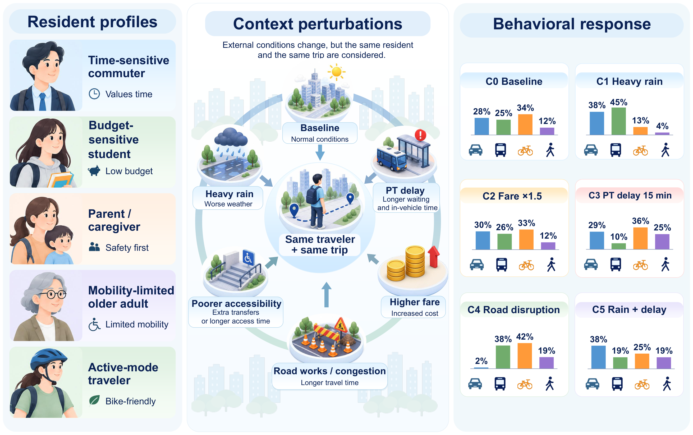
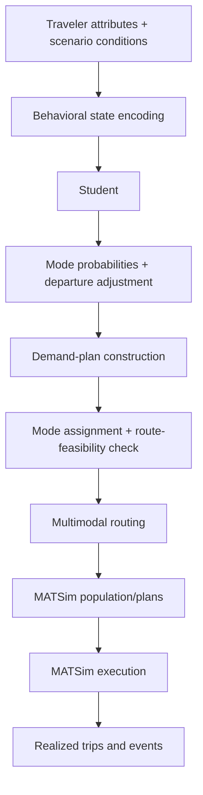

# DeepSeek Traveler Behavior Distillation Research

**Beyond Static Imitation: Evaluating LLM-Derived Traveler Responses for Transport Simulation**

An Xu, Chengbo Zhang, Zekai Jin, Yimin Zhao and Yunfei Yin

This repository contains code, released models and supporting evidence for evaluating whether a compact traveler model preserves an LLM Teacher's response to changing travel conditions. The study then checks agreement with stated human choices and tracks responses through transport simulation. Students predict probabilities for car, public transport (PT), bicycle and walking, together with a departure-time adjustment. Behavioral prediction runs locally after training.

## Reviewer guide

| Task | Start here |
|---|---|
| Understand the questions, models and evaluation boundaries | [Research design](docs/RESEARCH_DESIGN.md) and [training](docs/TRAINING.md) |
| Inspect the current manuscript evidence | [3 October support package](docs/manuscript-support/2026-10-03/README.md) and [extended records R1–R5](docs/manuscript-support/2026-09-30/README.md) |
| Check stated-choice instruments, sample flow and results | [Questionnaires and survey results](docs/surveys/README.md) |
| Trace code, models, inputs and reproduction limits | [Reproduction guide](docs/REPRODUCIBILITY.md) and [data provenance](docs/DATA_SOURCES.md) |
| Check ethics, contributions and AI-use statements | [Current author declarations](docs/manuscript-support/2026-10-03/DECLARATIONS.md) |

The current manuscript is supported by the versioned records above. The [article PDF](paper/cas-sc-template.pdf) and [supplement PDF](paper/supplement.pdf) under `paper/` are **historical snapshots dated 24 September 2026**. They do not contain every later addition. No publication acceptance is claimed.

## Research questions

1. **Teacher fidelity:** Does matching predictions at individual states preserve changes between paired states? Controlled neural objectives and an MNL Student are evaluated separately from modular departure prediction.
2. **Agreement with people:** Do model responses agree with stated choices in Singapore and Shanghai? Human responses are held out from fitting and model selection.
3. **Simulation execution:** How do predicted responses change during mode assignment, route search and MATSim execution? Probabilities, assigned modes, routed modes and simulated PT boarding are tracked separately.



*Figure 1 from the manuscript. OpenAI ChatGPT was used to assist with the preparation of Figure 1. The profiles are illustrative; bars show rounded mode assignments before routing for 10,000 synthetic Singapore travelers, not survey choices. [Original PDF](docs/assets/figure1.pdf).*

## Evidence by experiment

| Experiment | Coverage | Evidence and interpretation |
|---|---|---|
| Original controlled response benchmark | Six held-out synthetic personas; 437 states; three neural training seeds | Direction+magnitude supervision reduces response error by 4.97% relative to soft KL; MNL-S reduces it by a further 14.30%. [Baseline results](docs/RESULTS.md) |
| Later synthetic-persona reference comparison | Thirty formal personas, separate from the original test split | Signed-response minus soft-KL error difference is −0.003199, with paired-persona 95% interval [−0.004863, −0.001622]. [Current support](docs/manuscript-support/2026-10-03/README.md) |
| Stated human choices | 332 Singapore people; 321 modeled Shanghai people | SA-Student accuracy is 66.93% / 80.46%, while intervention-specific response discrepancies remain. [Full response results](docs/surveys/RESULTS.md) |
| Original Helsinki execution study | One fixed population of 1,000 travelers; 140 runs | Perceived PT delay changes while the physical timetable remains fixed. SA-Student's deterministic PT response is −13.10 pp predicted and −12.30 pp simulated. [Execution results](docs/RESULTS.md#simulation-execution) |
| Later Helsinki physical-supply experiment | Forty model–arm–seed runs | Separate physical-supply contrasts and stage summaries. Assigned, routed and boarded PT counts agree in the retained forty-run ledger. [Verification and scope](docs/manuscript-support/2026-10-03/README.md) |

These experiments have different samples and denominators. Teacher judgments are numerical elicited targets, the surveys are convenience/snowball stated-choice samples, and MATSim outcomes are simulated trips. The study does not establish population-representative behavior, causal policy effects or citywide field validation.

The retained later reference protocol identifies **`deepseek-v4.1-flash` through OpenCode Go**. Historical supervision and the same-task survey reference are separate collections. The [current support index](docs/manuscript-support/2026-10-03/README.md#reference-identity-and-historical-text) explains the discrepancy between historical prose and retained service records; acquisition records remain unchanged.

## Quick start and offline checks

### Local released-model inference

```bash
python -m venv .venv
# Activate .venv using the command appropriate for your shell.
python -m pip install -e .
python -m pip install -r requirements-research.txt
python examples/predict_released_student.py
```

The example loads a frozen checkpoint and one synthetic held-out state. It requires neither an API key nor Java, a transport network or a new Teacher request. See [model use](docs/MODEL_USE.md).

### Verify retained summaries and repository documentation

```bash
python docs/manuscript-support/2026-10-03/verify_summaries.py
python scripts/check_repository_docs.py
```

The first check recomputes the thirty-persona primary contrast and interval, forty-run population/completion counts and five-seed response decompositions. The second checks Markdown links and copied-evidence hashes. These checks do not rerun training, respondent analyses, Teacher acquisition or MATSim. [Full reproduction scope](docs/REPRODUCIBILITY.md).

## Simulation workflow



Training uses offline Teacher targets. The evaluated simulations keep behavioral predictions fixed and do not feed simulated experience back into the Student. Full MATSim construction requires supply files and the Java/MATSim runtime. [Execution definitions](docs/EXECUTION_WORKFLOW.md).

## Models and repository map

| Material | Location |
|---|---|
| SA-Student, archival identifier S9 | [Frozen release](releases/s9_supply_aware_v2/README.md), 24,562 parameters |
| S7-W3 generic predecessor | [Release](releases/s7_w3_generic_core_v1/README.md) |
| Deprecated S8 | [Deprecation notice](docs/S8_DEPRECATION.md) |
| State schemas, Students, training and transport adapters | `src/traveler_distillation/` |
| Population-to-MATSim pipeline | `reference_pipeline/` |
| Experiment and statistical analysis | `scripts/` and `cvpr_workspace/analysis/statistics/` |
| Prepared synthetic benchmark and controlled models | `outputs/matched_response_v1/` |
| Modular-model evidence | `outputs/revision_20260921/` |
| Baseline manuscript tables, aggregate outputs and hashes | [Evidence index](evidence/paper_20260924/README.md) |
| Later manuscript evidence | [Versioned support](docs/manuscript-support/2026-10-03/README.md) |
| Earlier results and experiment designs | [Development archive](archive/development_history/README.md) |

Historical source directories retain their original names. The [documentation history](docs/DOCUMENTATION_HISTORY.md) distinguishes model versions and manuscript editions.

## Data access, ethics and citation

This repository is public. Public access does not grant a new license; third-party terms still apply. The current release provides synthetic benchmark materials and aggregate evidence. Raw participant workbooks and participant-linked inputs are excluded from this release. Full event archives and restricted supporting materials require separate privacy-aware access. The reproduction guide describes the tasks supported by the included materials. [Availability and third-party terms](docs/DATA_SOURCES.md#access-and-redistribution).

The surveys were administered anonymously with electronic consent. The study was conducted without a formal institutional ethics review or exemption determination. The [author declarations](docs/manuscript-support/2026-10-03/DECLARATIONS.md) also document funding, competing interests, contributions and ChatGPT assistance with language editing and Figure 1.

Please cite the manuscript using [CITATION.cff](CITATION.cff) and identify the exact repository commit used in your analysis.
