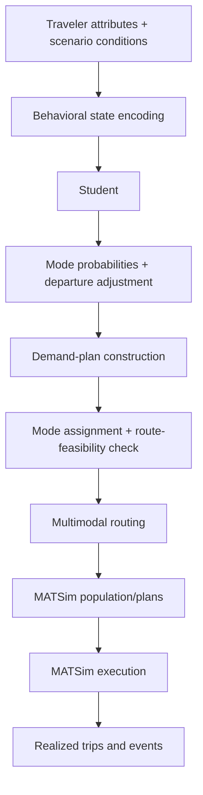

# DeepSeek Traveler Behavior Distillation Research

**Beyond Static Imitation: Auditing LLM-Derived Traveler Responses for Transport Simulation**

An Xu, Zekai Jin Chengbo Zhang and Yunfei Yin

This project studies whether a compact traveler model can preserve an LLM Teacher's **response to changing travel conditions**, and whether that response remains useful when compared with stated choices and carried into transport simulation. The Students predict probabilities for car, public transport (PT), bicycle and walking, together with a departure-time adjustment. Behavioral prediction runs locally after training.

[Research and design](docs/RESEARCH_DESIGN.md) · [Data sources](docs/DATA_SOURCES.md) · [Training](docs/TRAINING.md) · [Results](docs/RESULTS.md) · [Questionnaires](docs/surveys/README.md) · [Model use](docs/MODEL_USE.md) · [Reproduction](docs/REPRODUCIBILITY.md)


*Figure 1 from the current manuscript. The profiles are illustrative; bars show rounded mode assignments before routing for 10,000 synthetic Singapore travelers, not survey choices. [Download the original PDF](docs/assets/figure1.pdf).*

## Research questions

1. **Teacher fidelity:** Does matching predictions at individual states also preserve changes between paired states? We compare four neural objectives under matched training conditions and an MNL Student with separate departure prediction.
2. **Agreement with people:** Do model responses agree with stated choices in Singapore and Shanghai? Human responses are held out from fitting and model selection.
3. **Simulation execution:** How do predicted responses change during mode assignment, route search and MATSim execution? We track probabilities, assigned modes, routed modes and simulated PT boarding separately.

## Main findings

| Evidence | Result | Interpretation |
|---|---|---|
| Six held-out synthetic personas; three training seeds | Direction+magnitude supervision reduces probability-response error by **4.97%** relative to soft KL; MNL-S reduces it by a further **14.30%** | A simpler choice specification can outperform the joint neural model on Teacher response fidelity |
| Independent neural timing with MNL-S | Departure MAE **7.61 ± 0.72 min** against the Teacher | Choice and timing can be modeled separately; timing fits use a different selection criterion |
| Singapore: 332 people; Shanghai: 321 modeled people | SA-Student accuracy **66.93% / 80.46%** | Accuracy alone is insufficient: intervention-specific response discrepancies remain |
| Singapore poorer PT access | MNL-S predicts **+13.85 pp** PT response; respondents show **−24.40 pp** | The model closest to the Teacher can reverse a human response |
| Helsinki: 1,000 fixed travelers, 140 runs | SA-Student deterministic response: **−13.10 pp** predicted versus **−12.30 pp** simulated | Feasibility-constrained assignment improves routability but does not necessarily reduce the response gap |

These are distinct evidence levels. Teacher judgments are numerical elicited targets, the surveys are convenience/snowball stated-choice samples, and MATSim outcomes are simulated trips. The study does not establish population-representative behavior, causal policy effects or citywide field validation. [Full results and uncertainty](docs/RESULTS.md).

## Experimental execution workflow



This is the deployment sequence. Training uses offline Teacher targets; the evaluated simulation keeps behavioral predictions fixed and does not feed simulated experience back into the Student. [Assignment, routing and event definitions](docs/EXECUTION_WORKFLOW.md).

## Start here

| Reader | Recommended route |
|---|---|
| Reviewer | [Study design](docs/RESEARCH_DESIGN.md) → [complete results](docs/RESULTS.md) → [evidence and reproduction scope](docs/REPRODUCIBILITY.md) |
| Researcher | [Data provenance](docs/DATA_SOURCES.md) → [training objectives and splits](docs/TRAINING.md) → [questionnaire instruments and results](docs/surveys/README.md) |
| Model user | [Model card and quick start](docs/MODEL_USE.md) → [execution workflow](docs/EXECUTION_WORKFLOW.md) |

The [main article](paper/revision_20260925/cas-sc-template.pdf) and [supplement](paper/revision_20260925/supplement.pdf) are the 25 September 2026 evidence-limited revision, based on the author-supplied response-fidelity source package. [Editable LaTeX sources](paper/source/README.md), [API provenance and cost accounting](docs/API_COST_AND_PROVENANCE.md), and the [original experiment proposal](docs/REVISION_EXPERIMENT_PLAN.md) accompany them. That editorial snapshot preceded the [subsequent authorized experiments](docs/EXPERIMENTS_20260925.md). Their separate evidence report covers controlled fitting, a delay-family holdout, a new synthetic reference and physical-supply simulations; these results have not been incorporated into the manuscript. The complete 432-response pilot and separate 30-persona, 1,080-response formal sample have passed audit. In the formal primary comparison, signed L1 lowers response error by 0.00320, but it is worse on delayed states after delay-family holdout. Service-metadata variation is retained and described. Independent new-human validation remains deferred. These are research manuscripts; no publication acceptance is claimed. The [current inventory](docs/REPRODUCIBILITY.md) describes reproduction coverage.

## Models and supporting materials

| Material | Location | Role |
|---|---|---|
| **SA-Student**, archival identifier **S9** | [Frozen release](releases/s9_supply_aware_v2/README.md) | 24,562-parameter supply-adapted model; fixed during survey and execution evaluation |
| S7-W3 | [Predecessor release](releases/s7_w3_generic_core_v1/README.md) | Generic behavioral initialization for adaptation |
| S8 | [Deprecation notice](docs/S8_DEPRECATION.md) | Historical checkpoint with incorrect active-mode speed inputs; not a current result |
| Controlled neural fits | [Training records](outputs/matched_response_v1/train) | Four objectives × three seeds, selected by validation macro-source KL |
| Prepared benchmark | [Bundle](outputs/matched_response_v1/bundle) | Synthetic states, targets, splits, response pairs and interactions |
| Modular timing fits | [Baseline records](outputs/revision_20260921/baselines) | Separate timing selection and evaluation |
| Manuscript evidence | [Evidence index](evidence/paper_20260924/README.md) | Published-precision tables, aggregate outputs and file hashes |

The repository is access-controlled as of this update. This revision does not change its visibility or grant new licenses. Raw participant workbooks and participant-linked Teacher payloads are not added. Large MATSim event archives remain retained by the authors; the repository includes run-level results and their analysis code. [Availability and third-party terms](docs/DATA_SOURCES.md#access-and-redistribution).

## Quick start: local model inference

```bash
python -m venv .venv
# Activate .venv using the command appropriate for your shell.
python -m pip install -e .
python -m pip install -r requirements-research.txt
python examples/predict_released_student.py
```

The example loads a released checkpoint and one synthetic held-out state. It requires neither an API key nor Java, a transport network or a new Teacher request. Full MATSim construction additionally requires supply files and the Java/MATSim runtime. [Detailed usage](docs/MODEL_USE.md).

## Repository map

```text
docs/                         Research, data, training, results and user guides
docs/surveys/                 English questionnaires and complete response tables
docs/assets/                  Manuscript Figure 1 and supporting figures
paper/                        Main article and supplement PDF snapshots
src/traveler_distillation/    State schemas, Students, training and transport adapters
reference_pipeline/          Reusable population-to-MATSim pipeline
scripts/revision_20260921/    Later experiment and statistical analysis code
outputs/matched_response_v1/  Prepared synthetic benchmark and selected fitted models
outputs/revision_20260921/    Compact modular-model evidence
evidence/paper_20260924/       Current manuscript tables and aggregate results
releases/                    Original model versions and translated documentation
archive/                     Earlier plans and experiment history
```

Historical reports remain available for provenance. Their dates, model names and scope matter: earlier MNL-B, single-city deployment and prototype feedback experiments are not the current MNL-S comparison or the 140-run Helsinki experiment. [Documentation history](docs/DOCUMENTATION_HISTORY.md).
