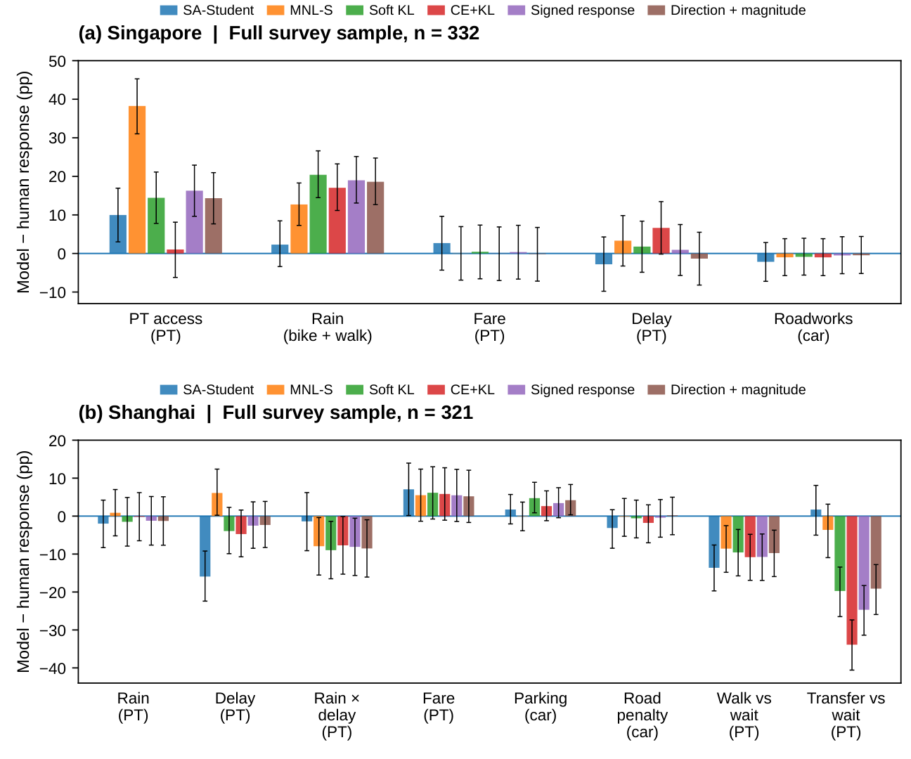

# Experimental results

Results below follow the **24 September 2026 manuscript**. Earlier repository reports describe different stages and should not be combined as if they used identical populations, supervision or denominators. Full-precision retained aggregate outputs and reported-precision manuscript tables are indexed in the [evidence directory](../evidence/paper_20260924/README.md).

## Controlled Teacher-response benchmark

Test: 437 states, 398 pairs and 94 interactions from six held-out synthetic personas. Neural values are mean ± sample SD across three training seeds; MNL-S is a single choice fit. Lower is better.

| Objective/model | Macro-source KL | Probability-response error | Interaction error |
|---|---:|---:|---:|
| Soft KL | 0.0915 ± 0.0187 | 0.0693 ± 0.0032 | 0.0457 ± 0.0038 |
| CE+KL | 0.1046 ± 0.0170 | 0.0753 ± 0.0016 | 0.0518 ± 0.0038 |
| Signed response | 0.0871 ± 0.0138 | 0.0665 ± 0.0050 | 0.0465 ± 0.0036 |
| Direction+magnitude | 0.0861 ± 0.0145 | 0.0659 ± 0.0042 | 0.0464 ± 0.0039 |
| MNL-S | 0.0731 | 0.0564 | 0.0386 |

The 4.97% improvement of direction+magnitude over soft KL and further 14.30% reduction with MNL-S are computed from unrounded results. Model selection uses validation macro-source KL. Paired persona-clustered intervals are conditional on the six test personas, separate from training-seed SD.

Direction+magnitude remains better than soft KL when each test persona is omitted from evaluation, with improvements in all 18 seed/removal combinations. This is reaggregation without retraining. Repeat-target sensitivity covers 373 states and 350 complete pairs; 64 mechanism states lack individual repeated outputs and are excluded. [Comparison records](../outputs/matched_response_v1/comparison/comparison.json) and [robustness outputs](../outputs/revision_20260921/baselines).

## Departure timing

MNL-S with independent neural timing reaches **7.61 ± 0.72 minutes** departure MAE, at 18,733 total parameters. It remains 0.180 minutes above the best joint timing-selected model, CE+KL, with persona-clustered 95% interval [0.002, 0.418]. This is a distinct comparison selected by validation departure MAE; it must not be treated as the choice-selected checkpoint's timing result. [All timing fits](../outputs/revision_20260921/baselines/departure_comparison.csv).

## Human stated choices

Singapore has 3,320 scored choices from 332 people. Shanghai has 3,208 scored explicit choices from 321 modeled people. All explicit choices are scored, even when the model assigns zero probability because of ownership/availability. The primary profile is **`ownership`**. Historical `survey_options` exports use all displayed alternatives and are a support-expansion diagnostic, not the paper's primary result.

| Model | Singapore accuracy (%) | Singapore PT bias (pp) | Singapore mean absolute response bias (pp) | Shanghai accuracy (%) | Shanghai PT bias (pp) | Shanghai mean absolute response bias (pp) |
|---|---:|---:|---:|---:|---:|---:|
| SA-Student | 66.9 | −30.7 | 4.0 | 80.5 | −16.8 | 5.8 |
| MNL-S | 71.1 | −3.8 | 11.1 | 81.8 | −5.4 | 4.1 |
| Soft KL | 72.9 ± 0.9 | −17.7 ± 3.3 | 8.2 ± 3.3 | 78.5 ± 1.7 | −12.3 ± 7.9 | 7.6 ± 0.9 |
| CE+KL | 69.7 ± 0.3 | −23.5 ± 3.5 | 6.9 ± 1.7 | 77.1 ± 3.0 | −15.0 ± 6.8 | 9.1 ± 1.9 |
| Signed response | 73.1 ± 1.2 | −16.0 ± 3.5 | 8.6 ± 3.0 | 79.8 ± 1.1 | −10.7 ± 6.2 | 7.7 ± 1.8 |
| Direction+magnitude | 71.8 ± 3.1 | −16.7 ± 6.2 | 8.8 ± 2.0 | 80.3 ± 0.5 | −10.4 ± 5.9 | 7.5 ± 1.0 |

Always predicting PT gives 66.57% / 71.98% accuracy. PT bias is mean predicted probability minus stated share. Absolute response bias is first averaged over contrasts within each fit and then over fitted seeds; it is not the absolute value of a seed-averaged signed bias.

SA-Student approximates Singapore delay and rain responses but understates poorer-accessibility response. Its Singapore access bias is **+9.98 pp**, with family-adjusted interval [3.01, 16.93]. In Shanghai it overreacts to encoded PT delay: **−30.57 pp** predicted against **−14.64 pp** stated; bias **−15.93 pp**, adjusted interval [−22.41, −9.21]. Fare and walking-versus-waiting responses have the wrong sign. MNL-S has the smallest Teacher error yet predicts **+13.85 pp** under poorer Singapore access, opposite to the stated **−24.40 pp**.

The [complete 78-row response table](surveys/RESULTS.md) includes all six model families and all five/eight contrasts, with denominators and adjusted intervals. [English instruments and sample flow](surveys/README.md).

## Contemporary Teacher comparison

The main diagnostic cohort has 24 people per city × ten tasks × three valid requests = **1,440 valid Teacher outputs** on 480 states. The Teacher does not see human answers. The final paper-aligned evaluation uses the ownership-conditioned, neutral-metadata and accessibility-aware setup; earlier full/pilot campaigns have distinct purposes. The [campaign summary](../evidence/paper_20260924/teacher_campaign_summary.json) preserves those distinctions.

On the selected Singapore access tasks, human PT response is −37.50 pp, contemporary Teacher response −15.40 pp, and SA-Student response −13.46 pp. On selected Shanghai delay tasks, human and Teacher responses are −8.33 and −8.17 pp, while SA-Student gives −34.87 pp; its Teacher discrepancy is −26.70 pp, with family-adjusted interval [−36.95, −15.42].

The identity `Student − human = (Teacher − human) + (Student − Teacher)` describes current discrepancies. It does not identify their historical cause, because service drift may enter the Student–Teacher term. Opposing terms can cancel. [Reported-precision decomposition](../evidence/paper_20260924/data_tables/teacher_decomposition_published_precision.csv).

## Simulation execution

The fixed 1,000-person Helsinki experiment has 140 runs and 70 paired baseline/delay comparisons. The intervention changes perceived PT delay by 15 minutes and leaves the physical timetable fixed.

| Model | Assignment | Predicted PT response (pp) | Simulated PT response (pp) | Gap (pp) |
|---|---|---:|---:|---:|
| SA-Student | Deterministic | −13.10 | −12.30 | +0.80 |
| SA-Student | Stochastic | −13.10 | −14.17 | −1.07 |
| SA-Student | Feasibility-constrained | −13.10 | −14.17 | −1.07 |
| Soft KL | Deterministic | −6.97 ± 4.92 | −8.03 ± 5.13 | −1.06 ± 1.24 |
| Soft KL | Stochastic | −6.97 ± 4.92 | −6.97 ± 3.32 | +0.01 ± 2.18 |
| Soft KL | Feasibility-constrained | −6.97 ± 4.92 | −7.06 ± 3.41 | −0.08 ± 2.04 |
| Direction+magnitude | Deterministic | −6.77 ± 4.96 | −8.63 ± 4.76 | −1.87 ± 1.33 |
| Direction+magnitude | Stochastic | −6.77 ± 4.96 | −7.12 ± 3.97 | −0.35 ± 1.30 |
| Direction+magnitude | Feasibility-constrained | −6.77 ± 4.96 | −7.22 ± 4.06 | −0.45 ± 1.24 |
| MNL-S + neural timing | Deterministic | −6.84 ± 0.00 | −6.90 ± 0.00 | −0.06 ± 0.00 |
| MNL-S + neural timing | Stochastic | −6.84 ± 0.00 | −6.63 ± 0.00 | +0.21 ± 0.00 |
| MNL-S + neural timing | Feasibility-constrained | −6.84 ± 0.00 | −6.67 ± 0.00 | +0.17 ± 0.00 |

Sampled results average assignment repetitions within a fitted model before averaging models; ± is training-seed SD. MNL-S timing seeds are not independent choice fits. SA-Student assignment SD is 1.55 pp for ordinary sampling and 1.40 pp for constrained sampling. The deterministic SA-Student gap has a paired-person 95% interval [−0.77, 2.38].

At SA-Student baseline, mean PT probability is 27.74%, 218 people are assigned PT and 161 board before reaching their outbound destination. Thus the level falls by more than eleven points while the response gap is below one point. Constrained assignment improves routability without reducing the response gap in this population. Applied departure adjustment changes 279 baseline and 313 delay itineraries even when binary PT feasibility is unchanged.

Signed averages can hide cancellation: the stochastic soft-KL mean gap is near zero, but its model-specific means range from −2.17 to +2.18 pp. Taking absolute model-specific gaps after averaging assignment repetitions gives 1.45 pp for soft KL and 0.91 pp for direction+magnitude.

In the separate Shanghai speed comparison, PT counts remain 224/134 and all 321 people finish, yet the paired outbound-time change switches from −4.44 minutes under road-derived active-mode speeds to +14.04 under mode-specific caps (95% interval [11.18, 17.05]). Network speed assumptions matter even when plans and modes agree.

[70 run-pair summaries](../evidence/paper_20260924/data_tables/helsinki_run_pairs_published_precision.csv) · [Full-precision run summaries](../evidence/paper_20260924/execution/run_summary.csv) · [Execution definitions](EXECUTION_WORKFLOW.md).

## Computational results

Scenario construction for 10,000 Singapore agents takes 51.1 minutes, with 10.3 seconds in behavioral inference. At 50,000 agents, construction takes 231.8 minutes and inference 48.8 seconds, approximately 0.34% and 0.35% of construction time. The main cost is feature/supply preparation and routing.

Reusing unchanged supply calculations reduces construction from 3,223.6 to 469.5 seconds in Singapore and from 10,491.8 to 103.2 seconds in Helsinki, preserving mode and OD assignments. These are particular measured reuse conditions with concurrent-workload limitations. Model-only inference excludes encoding/routing; MNL-S plus neural timing takes 1.68 ± 0.33 microseconds per state versus 1.78–2.16 for joint models.

Teacher latency includes successful calls only; population-scale Teacher times are projections. These comparisons do not amortize every supervision request, failure, retry and training cost.
